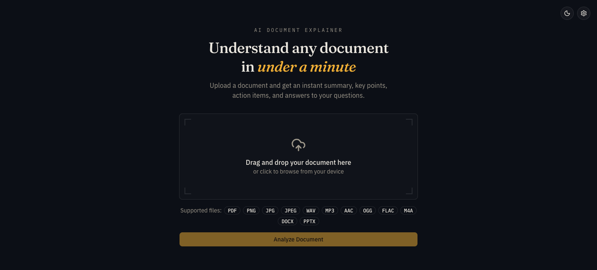
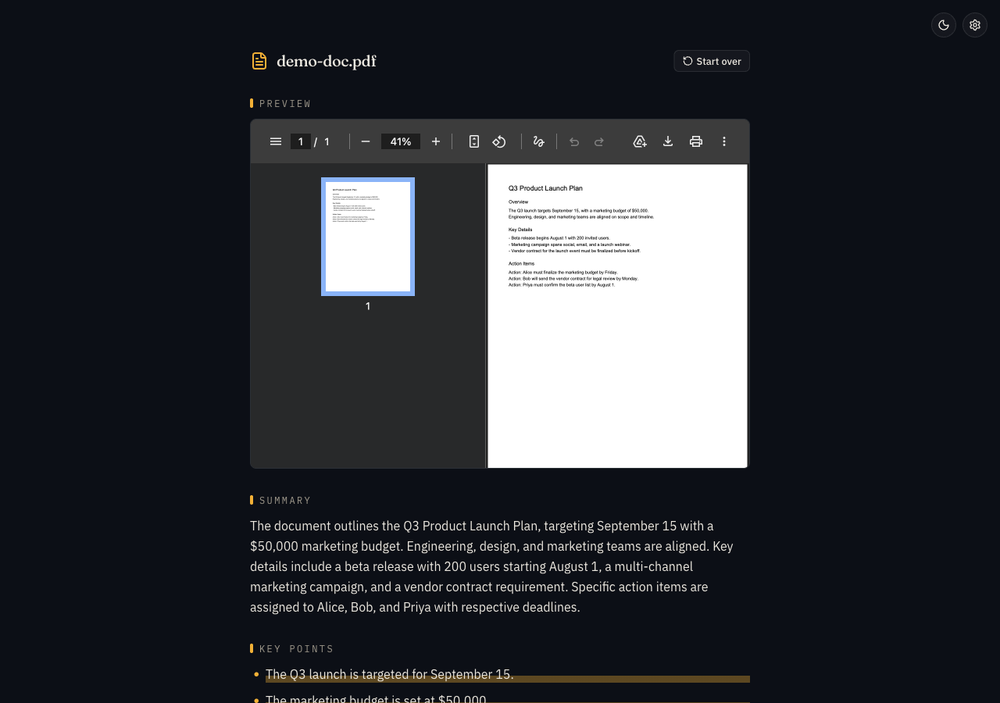
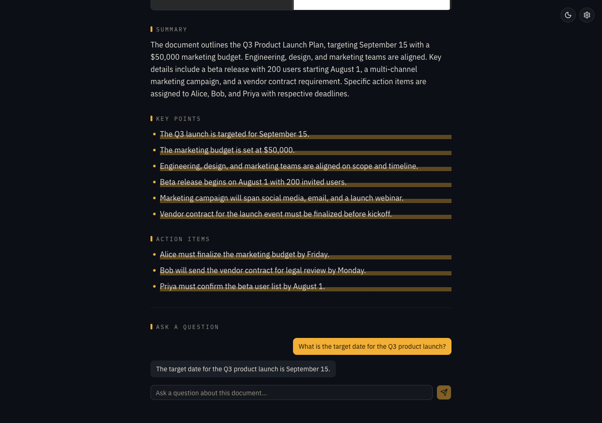
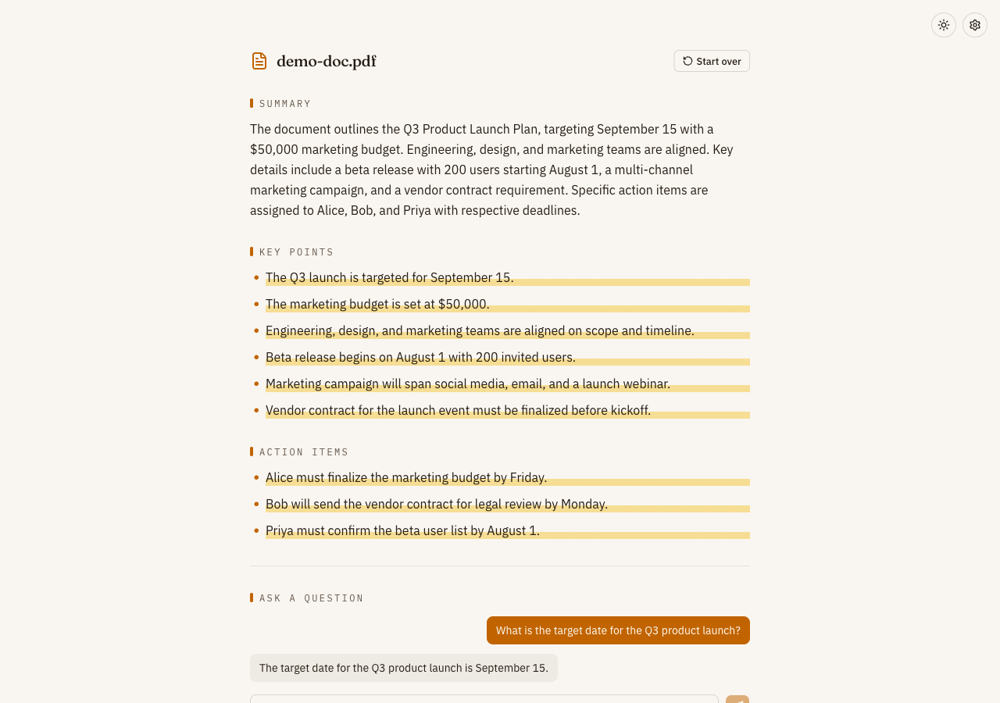

# AI Document Explainer

Upload a document and get an instant summary, key points, action items, and a
chat interface to ask follow-up questions — all grounded in the document's
own content, powered by Google Gemini.

Live at [ai-document-explainer-mu.vercel.app](https://ai-document-explainer-mu.vercel.app).

## Screenshots

**Upload** — drag and drop or browse for a file, with a live cost/size hint before you commit.



**Analysis** — the original file previews inline (native rendering for PDF/image/audio) alongside the AI-generated summary.



**Chat** — key points and action items reveal with a highlighter-style sweep; ask follow-up questions grounded only in the document's content.



**Light mode** — the same "paper and ink" palette, by daylight instead of lamplight.



## Features

- **Broad format support** — PDF, PNG, JPG/JPEG, audio (WAV, MP3, AAC, OGG,
  FLAC, M4A), and Word/PowerPoint (`.docx`, `.pptx`). Audio and images are
  understood natively by Gemini; Office documents are text-extracted
  server-side first (Gemini doesn't read those formats natively).
- **Structured analysis** — an executive summary, key points, action items,
  and AI-suggested follow-up questions, produced in a single model call.
- **Streaming chat** — ask questions about the document; answers stream in
  token-by-token and are grounded only in the document's extracted content.
- **Selectable model and temperature** — pick between Flash-Lite (cheapest,
  default), Flash, and Pro tiers, and adjust generation temperature, from a
  settings panel. A cost/size hint shows before you commit to analyzing.
- **Inline document preview** — PDFs and images render inline, audio gets a
  native player, and Office files get a download link (no inline preview
  available for those formats).
- **Session persistence** — your analysis and chat history survive a page
  reload; a "Start over" action resets without needing to reload.
- **Retry without re-upload** — transient failures (rate limits, empty AI
  responses) let you retry the same upload without sending the file again.
- **Light/dark theme** — toggle with a default of dark.

## Tech stack

- [Next.js 16](https://nextjs.org) (App Router, Turbopack) + React 19 + TypeScript
- [Tailwind CSS v4](https://tailwindcss.com) with [shadcn/ui](https://ui.shadcn.com) (`base-nova` style) on [Base UI](https://base-ui.com) primitives
- [Google Gemini API](https://ai.google.dev) via `@google/genai`
- [Vercel Blob](https://vercel.com/docs/vercel-blob) for temporary upload storage
- [`officeparser`](https://www.npmjs.com/package/officeparser) for `.docx`/`.pptx` text extraction
- [`next-themes`](https://github.com/pacocoursey/next-themes) for theme switching
- Fraunces, IBM Plex Sans, and IBM Plex Mono via `next/font/google`

## Getting started

### Prerequisites

- [Bun](https://bun.sh)
- A [Gemini API key](https://aistudio.google.com/apikey)
- A [Vercel Blob](https://vercel.com/docs/vercel-blob) store (`BLOB_READ_WRITE_TOKEN`)

### Setup

```bash
bun install
cp .env.example .env.local
```

Fill in `.env.local`:

```bash
GEMINI_API_KEY=       # from https://aistudio.google.com/apikey
BLOB_READ_WRITE_TOKEN=  # from your Vercel project's Blob store settings
```

### Run the dev server

```bash
bun dev
```

Open [http://localhost:3000](http://localhost:3000).

## Scripts

- `bun dev` — start the development server
- `bun run build` — build for production
- `bun start` — run the production build
- `bun run lint` — lint the codebase

## Deployment

Deployed on [Vercel](https://vercel.com). Both `GEMINI_API_KEY` and
`BLOB_READ_WRITE_TOKEN` need to be set on the Vercel project (Production,
Preview, and Development environments) — they aren't picked up from a local
`.env` file at build time.
